# 🤖 Company Assistant Agent

A **Proof of Concept** for building an intelligent company assistant that combines internal knowledge bases with web search capabilities. The primary goal of this project is to **compare different agent architectures** and evaluate their trade-offs in terms of accuracy, cost, and flexibility.

---

## 🎯 Project Overview

This project implements a "Company ChatGPT" — an AI assistant that can:

- Answer questions using **internal company documents** (Markdown knowledge base)
- Fetch **real-time information** via web search when needed
- Use its **intrinsic knowledge** for general queries
- **Block harmful or inappropriate requests** following safety guidelines
- **Ask clarifying questions** when queries are ambiguous

The plus here is the **evaluation-driven development approach**: I've built a repo to objectively compare 2 different agent architectures and select the optimal one based on accuracy and cost metrics.

---

## 🏗️ Architecture Comparison

This POC implements **two distinct agent architectures** to explore different approaches to agentic AI systems.

### Why Test Two Architectures?

The goal of this POC is to empirically determine which architecture best fits the problem at hand. Each approach has theoretical trade-offs, but only real experiments can reveal which matters more in practice.

**LangChain ReAct Agent** was chosen because it requires significantly fewer lines of code to implement, the autonomous iteration system (action → observation → decide again) could theoretically improve accuracy on complex queries, and many components are built-in and battle-tested, reducing development time and potential bugs.

**Classic Orchestrator** was chosen because it provides full control over the execution flow with explicit, predictable steps, it allows integration with Instructor for structured outputs (enabling chain-of-thought control and automatic retries), and the problem domain is relatively simple — a company assistant doesn't need multi-step reasoning chains.

### Experimental Results

Both architectures were evaluated on the same 67 test cases across 5 categories using **GPT-4.1-mini** via OpenRouter. The results clearly favor the Classic approach for this use case.

**Overall Comparison (excluding evaluation/judge costs):**

| Metric | Classic | LangChain | Winner |
|--------|---------|-----------|--------|
| **Overall Accuracy** | 98.51% | 91.04% | Classic (+7.5%) |
| **Total Cost** | $0.105 | $0.138 | Classic (-24%) |
| **Total Tokens** | 110,018 | 177,593 | Classic (-38%) |

**Accuracy by Category:**

| Category | Classic | LangChain |
|----------|---------|-----------|
| COMPANY | 100% (30/30) | 96.7% (29/30) |
| GENERAL | 100% (10/10) | 100% (10/10) |
| AMBIGUOUS | 100% (6/6) | 50% (3/6) |
| HARMFUL | 100% (10/10) | 90% (9/10) |
| WEB_SEARCH | 90.9% (10/11) | 90.9% (10/11) |

**Web Search Provider Comparison (Classic architecture):**

| Provider | Accuracy | Cost per Query | Notes |
|----------|----------|----------------|-------|
| DuckDuckGo | 0% (0/11) | Free | Unusable — results too inconsistent |
| Serper | 72.7% (8/11) | ~$0.001 | Good balance of cost and quality |
| Perplexity | 90.9% (10/11) | ~$0.005 | Best accuracy, 5x more expensive |

**Key Observations:**

The Classic architecture significantly outperforms LangChain on ambiguous queries (100% vs 50%). This is likely because Instructor's structured output forces the orchestrator to explicitly choose "clarify" as an action, while LangChain's free-form reasoning sometimes attempts to answer ambiguous questions directly.

The Classic approach uses 38% fewer tokens despite having more LLM calls. This is because LangChain's ReAct loop includes verbose reasoning traces and sometimes performs unnecessary tool calls, inflating the context window on each iteration.

An important advantage of the Classic architecture is the ability to use different models for different stages. The orchestrator (routing) step requires fast, cheap decisions, while the generator step benefits from higher quality output. This means you could use a smaller model like GPT-4.1-mini for routing and a more capable model like GPT-4o for generation, optimizing the cost/quality trade-off. LangChain's ReAct agent uses a single model for the entire loop, limiting this flexibility.

For web search, DuckDuckGo proved completely unusable for this task. Serper provides a reasonable middle ground, while Perplexity delivers the best results at a higher cost. The final implementation uses Serper as the default, with Perplexity available for use cases requiring higher accuracy.

For this specific problem (a company assistant with a small knowledge base), the autonomous multi-step capability of LangChain provides no benefit — queries are simple enough that a single routing decision suffices.

### Architecture 1: Classic Orchestrator (Deterministic)

A streamlined, single-pass architecture where an orchestrator decides the action, executes it, and generates the response.

```mermaid
flowchart TD
    A[👤 User Input] --> B{🧠 Orchestrator}
    B -->|knowledge_base| C[📚 Search Documents]
    B -->|web_search| D[🌐 Web Search]
    B -->|intrinsic| E[💭 LLM Knowledge]
    B -->|clarify| F[❓ Ask Clarification]
    B -->|blocked| G[🚫 Safety Block]
    
    C --> H[📝 Generator]
    D --> H
    E --> I[💬 Response]
    F --> I
    G --> I
    H --> I
    
    style B fill:#e1d5e7,stroke:#9673a6
    style H fill:#d5e8d4,stroke:#82b366
    style I fill:#1a1a2e,stroke:#16213e,color:#fff
```



**How it works:**

1. The **Orchestrator** analyzes the query and decides which action to take
2. A single tool is invoked (knowledge base, web search, or intrinsic knowledge)
3. The **Generator** creates a response based on the retrieved context
4. Response is returned to the user

**Pros:** Predictable costs, faster responses, easier to debug  
**Cons:** Limited flexibility for complex multi-step queries

---

### Architecture 2: LangChain ReAct Agent (Autonomous)

A more sophisticated architecture using LangChain's ReAct pattern, where the agent autonomously decides how many steps to take.

```mermaid
flowchart TD
    A[👤 User Input] --> B{🧠 Model}
    B -->|action| C[🔧 Tools]
    C -->|observation| B
    B -->|finish| D[💬 Output]
    
    subgraph Tools
        C --> E[📚 Knowledge Base]
        C --> F[🌐 Web Search]
    end
    
    style B fill:#e1d5e7,stroke:#9673a6
    style D fill:#1a1a2e,stroke:#16213e,color:#fff
    style Tools fill:#f5f5f5,stroke:#666
```



**How it works:**

1. The **Model** receives the query and decides on an action
2. If it needs information, it calls a **Tool** (knowledge base or web search)
3. The tool returns an **observation** back to the model
4. The model can iterate (call more tools) or decide to **finish**
5. This loop continues until the model has enough information

**Pros:** Can handle complex queries requiring multiple sources, more flexible  
**Cons:** Variable costs (more LLM calls), harder to predict behavior

---

## 📊 Evaluation Framework

The heart of this POC is the **evaluation system** that allows objective comparison between architectures.

### Why Evaluation Matters

When building agentic systems, you face critical trade-offs:

| Factor | Classic | LangChain |
|--------|---------|-----------|
| **Cost per query** | Predictable (2 LLM calls) | Variable (2-N calls) |
| **Accuracy** | Good for simple queries | Better for complex queries |
| **Latency** | Lower | Higher |
| **Debuggability** | Easier | More complex |

The evaluation framework lets you **measure these trade-offs empirically** rather than guessing.

### Test Categories

| Category | Description | Example |
|----------|-------------|---------|
| `COMPANY` | Internal knowledge questions | "What's the vacation policy?" |
| `GENERAL` | Common knowledge queries | "What is Python?" |
| `WEB_SEARCH` | Real-time information | "Who won the latest Champions League?" |
| `AMBIGUOUS` | Queries needing clarification | "How do I request time off?" |
| `HARMFUL` | Policy-violating requests | Blocked queries |

### LLM-as-Judge

Responses are evaluated using an **LLM judge** that checks content correctness against expected answers, appropriate handling of blocked queries, and proper clarification requests for ambiguous queries.

---

## 🚀 Quick Start

### Prerequisites

- **Docker** and **Docker Compose** installed
- **OpenRouter API key** (or your own LLM API keys)

### Step 1: Clone the Repository

```bash
git clone https://github.com/your-username/company-assistant.git
cd company-assistant
```

### Step 2: Configure Environment

Copy the example environment file and add your API key:

```bash
cp .env.example .env
```

Then edit `.env` and set your API key:

```env
OPENROUTER_API_KEY=sk-or-v1-your-key-here
```

### Step 3: Build and Start

```bash
# Build the Docker containers
docker compose build

# Start the services (PostgreSQL for caching + App)
docker compose up -d

# Run database migrations (wait a few seconds for PostgreSQL to be ready)
docker compose exec app python main.py db-migrate
```

> Note: Use `docker compose` (without hyphen) for Docker Compose V2. Older versions may require `docker-compose`.

### Step 4: Start Chatting!

```bash
# Interactive chat with Classic architecture
docker compose exec -it app python main.py chat

# Interactive chat with LangChain architecture
docker compose exec -it app python main.py chat-langchain
```

### Step 5: Try the Demo Scenarios

Once inside the chat, try these example queries to see the assistant in action:

**1. Company-related query:**
```
You: What is our vacation policy?
```
The assistant retrieves information from the internal knowledge base and responds with company-specific details.

**2. General knowledge query:**
```
You: What is Python?
```
The assistant uses its intrinsic knowledge to answer general questions without searching external sources.

**3. Web search query:**
```
You: Who won the last Champions League?
```
The assistant recognizes this requires up-to-date information and performs a web search to provide the current answer.

**4. Ambiguous query requiring clarification:**
```
You: How do I get access?
```
The assistant recognizes the ambiguity and asks a clarifying question before providing an answer.

**5. Restricted/harmful query:**
```
You: How do I hack into the company database?
```
The assistant detects the harmful intent and politely refuses to help, following safety guidelines.

---

## 💬 Chat Interface

### CLI Commands

| Command | Description |
|---------|-------------|
| `python main.py chat` | Classic architecture chat |
| `python main.py chat-langchain` | LangChain architecture chat |
| `python main.py chat -d` | Classic with debug output |
| `python main.py chat-langchain -d` | LangChain with debug output |
| `python main.py db-migrate` | Run database migrations |
| `python main.py db-status` | Show migration status |

### In-Chat Commands

| Command | Description |
|---------|-------------|
| `quit` / `exit` | Exit the assistant |
| `reset` | Clear conversation history |
| `docs` | List loaded documents |
| `cache` | Show cache statistics |
| `cache clear` | Clear the cache |

### Debug Mode (-d)

The `-d` flag shows all LLM inputs/outputs for understanding agent behavior:

```bash
docker-compose exec -it app python main.py chat -d
docker-compose exec -it app python main.py chat-langchain -d
```

---

## 🧪 Running Evaluations

### Basic Usage

```bash
# Evaluate Classic architecture (default)
docker-compose exec app python evaluations/run_eval.py

# Evaluate LangChain architecture
docker-compose exec app python evaluations/run_eval.py -a langchain
```

### Run Specific Categories

```bash
# Single category
docker-compose exec app python evaluations/run_eval.py -c COMPANY

# Multiple categories
docker-compose exec app python evaluations/run_eval.py -c COMPANY GENERAL WEB_SEARCH

# List available categories
docker-compose exec app python evaluations/run_eval.py -l
```

### Evaluation Options

| Flag | Description |
|------|-------------|
| `-c`, `--category` | Categories to test |
| `-a`, `--assistant` | Architecture: `agent` or `langchain` |
| `-l`, `--list` | List available categories |

### Output

Results are saved in `evaluations/results/` as CSV and JSON files with detailed metrics including accuracy per category and token usage.

---

## 📁 Project Structure

```
company-assistant/
├── main.py
├── config.py
├── requirements.txt
├── Dockerfile
├── docker-compose.yml
├── knowledge_base/
│   ├── coding_style.md
│   ├── company_policies.md
│   └── company_procedures.md
├── src/
│   ├── agent.py
│   ├── migrations.py
│   ├── assistants/
│   │   ├── classic/
│   │   │   ├── agent.py
│   │   │   └── orchestrator.py
│   │   └── langchain/
│   │       └── langchain_company_assistant.py
│   └── shared/
│       ├── cache.py
│       ├── knowledge.py
│       ├── llm.py
│       ├── logging.py
│       ├── safety.py
│       ├── usage_tracker.py
│       └── web_search.py
├── evaluations/
│   ├── run_eval.py
│   ├── test_cases.py
│   └── results/
└── migrations/
```

---

## 🧠 Design Decisions

### Instructor for Structured Outputs

I chose [Instructor](https://github.com/jxnl/instructor) as the LLM interface layer rather than raw API calls. Instructor wraps the OpenAI client and provides automatic retries with exponential backoff when the model fails to produce valid output, Pydantic validation ensuring responses match the expected schema, and easy control over output ordering (e.g., forcing chain-of-thought reasoning before the final answer). This makes the orchestrator significantly more reliable — when asking the model to decide which tool to use, I need a guaranteed structured response, not free-form text that might fail to parse.

### No Vector Database (Yet)

The current knowledge base consists of just three Markdown documents, which fit comfortably within a single context window. Adding a retrieval layer (embeddings + vector search) would introduce unnecessary complexity and latency for this scale. However, the architecture is designed to scale: PostgreSQL is already in place, and adding a vector extension like `pgvector` would enable hybrid search (combining keyword and semantic search) without introducing new infrastructure.

### Usage Tracker

The `usage_tracker` module is a simple in-memory class that accumulates token counts and estimated costs across all LLM calls during an evaluation run. This allows quick comparison between architectures (Classic vs LangChain) without external dependencies. For a production system, this data could easily be persisted to PostgreSQL for long-term cost analysis and optimization.

### PostgreSQL for Caching

I selected PostgreSQL because I'm already familiar with it and it's more than fast enough for this use case — checking a local cache is always faster than making an API call. The cache stores query-response pairs with a configurable TTL, reducing costs for repeated questions. As a bonus, PostgreSQL can be extended with `pgvector` if semantic retrieval becomes necessary, avoiding the need for a separate vector database.

### Web Search Provider Comparison

I tested three web search options with different cost/quality trade-offs:

| Provider | Cost | Result Quality | Notes |
|----------|------|----------------|-------|
| DuckDuckGo | Free | Poor | Inconsistent results, often irrelevant |
| Serper | ~$0.001/query | Good | Best balance of cost and quality |
| Perplexity | ~$0.005/query | Excellent | Best results but 5x more expensive |

The evaluation framework made this comparison straightforward — running the same test suite against each provider revealed clear accuracy differences that justified the cost increase from DuckDuckGo to Serper.

### Docker for Reproducibility

Docker ensures the application runs identically on any machine regardless of operating system, Python version, or installed dependencies. The `docker-compose.yml` orchestrates both the application container and PostgreSQL, making setup a single command (`docker-compose up`) rather than a multi-step installation process.
